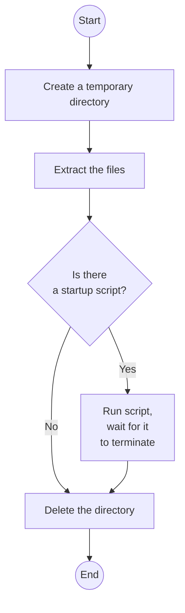
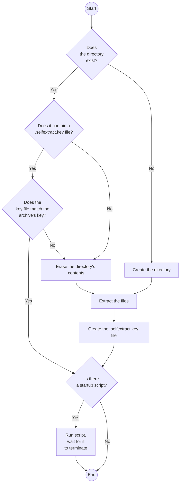

# Selfextract

Selfextract creates [self-extracting
archives](https://en.wikipedia.org/wiki/Self-extracting_archive).

When running such an archive, the files contained within are extracted to a
destination directory (either temporary or persistent). The extracted files can
contain a special "startup" script, in that case it will be automatically
executed right after extraction.

It is a proof-of-concept and has only been tested on Linux (i.e. when
Selfextract is compiled as an ELF executable).

## Usage

### Create an archive

The syntax is somewhat inspired from tar.

    ./selfextract [OPTION...] FILE ...
        -C string
                change dir before archiving files, only affects input files (default ".")
        -f string
                name of the archive to create (default "selfextract.out")
        -v  verbose output

Example:

    selfextract -f myarchive -C mydir .

This command will create the `myarchive` archive in the current directory. It
will contain the contents (`.`) of the `mydir` directory.

### Startup script

The startup script that you want to run after extraction must be put in the
archive just like any other file. By default it should be at the root and be
named `selfextract_startup`.

Example:

    mydir/
    ├── a
    ├── b
    ├── c
    └── selfextract_startup

If using the command given above to create the archive
(`selfextract -C mydir .`), then the startup script will be automatically
launched after the files have been extracted.

Note that this is why we want to write `-C mydir .` and not just `mydir`,
because in that latter case the `mydir` directory itself will be in the archive
at the root, and the startup script will not be at the root anymore.

### Execute the archive

The archive can of course be executed simply by running it. In that case, it
will be extracted in a temporary directory. Then, if there is a startup script
in the extracted files, it will be run. Finally, after the script exits, the
temporary directory will be deleted.

    ./myarchive

Of course this only makes sense if there is a startup script (otherwise the
files will just be extracted then deleted right after).

The archive can be configured with environment variables:

-   `SELFEXTRACT_DIR=<dir>` specifies a custom, persistent extraction directory
    (default: a temporary directory)
-   `SELFEXTRACT_STARTUP=<file>` specifies the name of the startup script
    (default: "selfextract_startup")
-   `SELFEXTRACT_VERBOSE=true` activates debug messages (default: false)

All the arguments passed on the command line will be passed to the startup
script.

    SELFEXTRACT_DIR=extractdir ./myarchive -a 1 -b 2

This will extract files into the `extractdir` directory, run the startup script
(with the arguments `-a 1 -b 2`), and when it's done, exit *without* deleting
the directory.

If this command is run again, since the extraction directory already exists, it
is reused, meaning the files will not be extracted again, only the startup
script will be launched. This enables a huge speedup.

## Internals

An archive made with `selfextract` consists of:

-   a **stub**, which is the executable part of the archive, to which is
    appended:
-   a **boundary**, a special value that marks the end of the executable
-   a unique **key**, to identify the archive
-   a **payload**, which is a zstd-compressed, tar-archived collection of files.

```
            self-executable archive
   0 ┌──────────────────────────────────┐
     │                                  │
     │         stub (executable)        │
     │                                  │
     ├──────────────────────────────────┤
     │             boundary             │
     ├──────────────────────────────────┤
     │                key               │
     ├──────────────────────────────────┤
     │                                  │
     │                                  │
     │                                  │
     │                                  │
     │                                  │
     │              payload             │
     │       (zstd-compressed tar)      │
     │                                  │
     │                                  │
     │                                  │
     │                                  │
     │                                  │
     └──────────────────────────────────┘
```

When you append data to an ELF binary, testing has shown that it still runs
completely fine. So, when the archive is executed, the program contained in the
stub:

-   reads its own file to locate the boundary
-   reads the key and the payload that come right after the boundary
-   extracts the files contained in the payload
-   creates a `.selfextract.key` that contains the unique key of the archive
-   runs the startup script

To avoid having to compile and distribute two different binaries (the CLI tool
to create binaries, and the archive stub), they're actually the same. When
creating an archive, Selfextract uses itself as the stub. It knows whether it is
used to create a binary or as a stub depending on whether it finds the boundary.

### Extracting to a temporary directory

If the path of the extraction directory is not specified, it defaults to a
temporary directory (a uniquely-named directory in `/tmp`). The directory is
automatically deleted after running.



### Extracting to a named directory

If an extraction directory is specified, it's a bit more complex.

Before extraction, the archive checks the existence of a key file in the
extraction dir to know if a previous extraction completed successfully (because
the key file is the last file to be written). It also checks its contents to
know if it was the same archive that was previously extracted (by matching the
value of the key). If everything matches, we can reuse the directory and skip
extraction. If not, we cleanup the directory and extract the files as normal.


